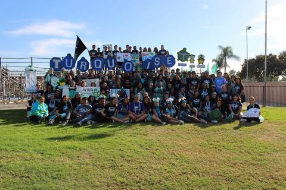

> Written with [StackEdit](https://stackedit.io/).
> Title of Website: Jungwan Kim Resume
> Jungwan Kim - Psychology

[Jungwan Kim   ](#page-top) 

-   [About](#about)
-   [Experience](#experience)
-   [Education](#education)
-   [Portfolio](#portfolio)

# Jungwan Kim

Psychology📚

Hello, my name is Jungwan "Jaclyn" Kim and I am currently a second year at UCR. As of right now, I am pursuing a career in Clinical Psychology and intend to be an author on the side due to my unwavering passion for writing. I was born in Los Angeles, California, but have lived in Seoul, Korea for the first six years of my life. Ever since I was seven years old, I've been raised in a single-parent household with a low income which compelled me to work towards attending a four-year university. As a first-generation college student, I've been expected to pursue a career path of a medical doctor which contradicted my wishes to become a clinical psychologist. My deeply rooted interest in cognitive processes and human behavior gave me the conviction that psychology is the field of study that I'd want to pursue.  
  
Furthermore, I'd developed a profound interest to study myself and others stemmed from my inclination to help others and push for self-growth as well as achievement of self-potential. To strengthen my leadership and communication skills alongside character development, I'd actively participated in a student-led organization called KIWIN'S during high school. Hence, KIWIN'S heavily contributed towards the acquisition of the aforementioned skills, character development, and other beneficial qualities that have helped shaped me into the individual I am today. I'd served as the club's secretary and readily exercised my organizational skills and initiative when fulfilling my responsibilities in addition to balancing AP classes/schoolwork.  
  
Moreover, I'd sought to showcase my work ethic by working at multiple jobs and thus, acquired a multitude of experience through daily interactions with customers as well as maintaining a cooperative spirit with my coworkers. Presently, I work at 85 Degree Bakery Cafe and hold two different positions in the store. My main position is cashier, or in the store's terms, "POS," which stands for Point of Service. Through this position, I interact with a wide range of customers on a daily basis and actively multitask in order to provide efficient, yet enjoyable customer service to the best of my abilities. Based on my job experience, I've recognized that one of the key components in being an excellent worker is to always maintain professional composure, especially during chaotic situations where you're expected to tackle multiple tasks at once with speed and efficiency. Furthermore, one of the primary benefits I've obtained from working at 85 Degree Bakery Cafe is an increased improvement of my social skills, which I'd be required to actively utilize as I'm advancing towards becoming a clinical psychologist. Aside from my experience at 85, I've worked as an agent for a skincare company called Seacret, and bore the responsibility of educating the wider public about the skin benefits from using natural products from the Dead Sea. My success in helping others to gain confidence about their skin by guiding them to choose skincare products that best suited their skin also gave me with the confidence in myself and my potential to help others.

----------

## Experience

### 85 DEGREE TEAM MEMBER

[85 DEGREE BAKERY](https://www.85cbakerycafe.com/)

• PRESIDED OVER FRESH BREAD DISPLAY AND PREPPED TEAS  
• TOOK CAKE AND BREAD PREORDERS  
• ASSISTED MULTIPLE CUSTOMERS AT THE SAME TIME  

Present

### SEACRET DIRECT AGENT

[SEACRET DIRECT](https://www.seacretdirect.com/www/en/us/)

• PROMOTING SKINCARE PRODUCTS  
• RECRUITING NEW MEMBERS TO JOIN THE SEACRET TEAM  

2018 - PRESENT

### MANDALAY VILLAGE CLEANERS

[MANDALAY VILLAGE CLEANERS](https://www.yelp.com/biz/mandalay-village-cleaners-port-hueneme)

• ASSISTED AROUND BY HANGING ORDERS, PREPPING, AND ORGANIZING CLOTHES TO RESPECTIVE PLACES  
• COMMUNICATED WITH CUSTOMERS WHEN ORDERS WERE FULFILLED  

2014 - 2016

----------

## Education

### UNIVERSITY OF CALIFORNIA - RIVERSIDE

PSYCHOLOGY (PRE-MED)

2018 - PRESENT

### ADOLFO CAMARILLO HIGH SCHOOL

HIGH SCHOOL GED

2016 - 2018

### OXNARD HIGH SCHOOL

HIGH SCHOOL GED

2014 - 2016

----------

## Portfolio

   
   
 

----------

©
> ![Screenshot of Preview in Cloud9] (img/screenshot of preview.png)
> 